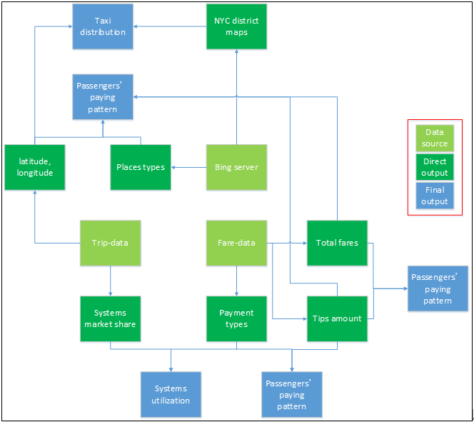
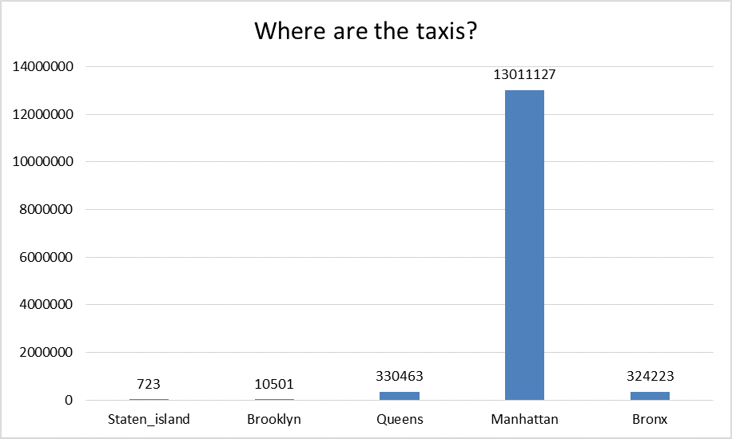
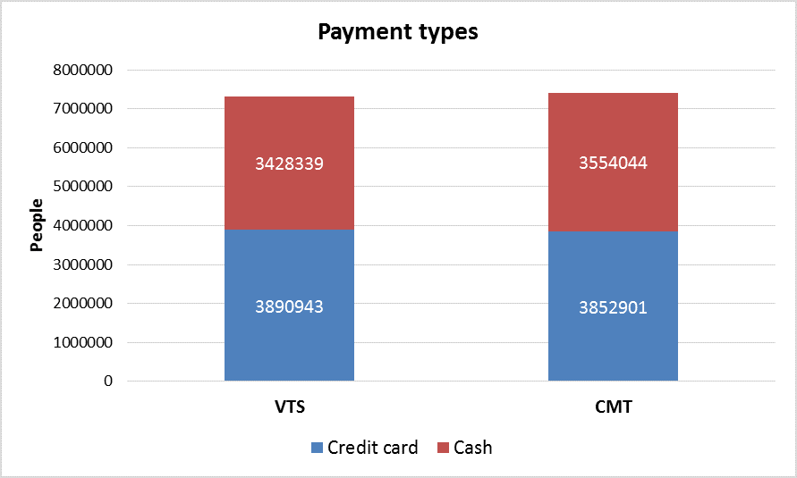
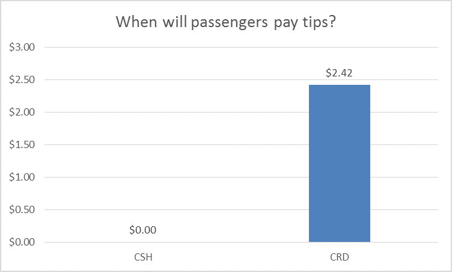
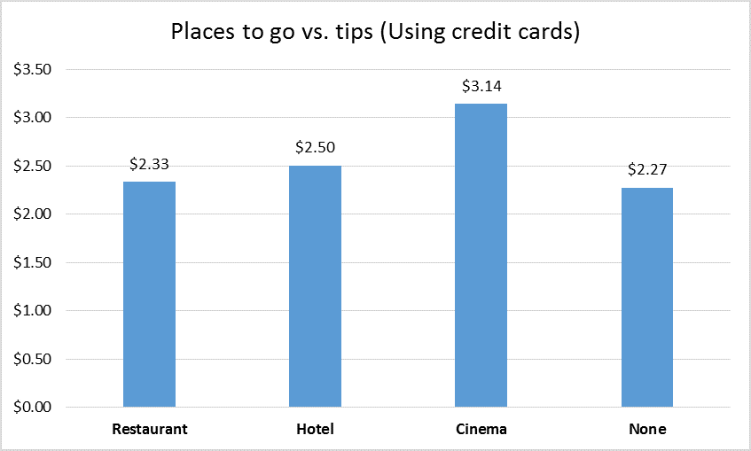

---
# New York City (NYC) taxi data analysis

Introduction
============

The yellow taxi is a symbol of New York. It facilities people’s daily
life by providing convenient transportation service. On average the
yellow taxis in the NYC provide 485,000 trips a day. So I may be able to
find some of people’s interesting behaviors or living patterns by
digging into their transportation data, that is, the travel data of
those yellow cabs running on the roads of NYC, day and night.

In specific, I are to identify the answers for the following questions:

-   Understanding taxis distribution. Before answering this question,
    one may guess that Manhattan has the most taxis among the
    five districts. But I still don’t have a clear idea on the
    difference between those numbers. How many times of taxis are there
    in Manhattan compared with Brooklyn? To answer these related
    questions, I need to figure out the actual distribution of taxis.

-   Identifying the performance of two vehicle-mounted systems. There
    are two types of those systems, Verifone Transportation
    Systems (VTS) and Mobile Knowledge Systems Inc (CMT) with the
    same functionality. Normally there is only one in a taxi. The
    systems is to help collect trip data, issue payments and so on. It
    is of interest to identify the market share of these two systems and
    find out whether passengers will take use of the system to pay
    taxi fees.

-   Understanding passengers’ payment patterns. Among them, one of the
    most interesting things is about tips. To understand passengers’
    paying behaviors related to tips, I are here to find answers to the
    following three questions:

    -   Tips vs. payment types. Will passengers more willing to use cash
        to pay tips or credit cards? Considering that the paying taxi
        fees using credit cards is enabled by the vehicle-mounted
        systems mentioned above, if I find that passengers are more
        likely to use cash to pay tips, I can conclude that passengers
        don’t actually use the systems quite Ill.

    -   Tips vs. total fares. By common sense the further a passenger
        goes, the higher possibility he will pay a high tip. I are here
        to validate that and also find out whether there are
        extra findings.

    -   Tips vs. places to go. Will people who go to a hotel pay a
        higher tip than ones go to a restaurant? In this report I only
        discuss the following types of places: restaurants, hotels
        and cinemas.

Following is a brief framework of this project.

Exploratory analysis
====================

Dataset
=======

To answer the above questions, I need to combine multiple data sources:

-   Taxi related data is from [2013 New York City Taxi
    Data](http://publish.illinois.edu/dbwork/open-data/). Basically
    there are two types of csv files in this data set. As mentioned from
    the linked webpage, “trip\_fare.csv” contains data about passengers’
    payment, and “trip\_data.csv” contains data about the trips. Each
    types of data is in 12 chunks, a chunk per month. In this project,
    due to the limited time, I only process the data in January. Of
    those data, what will be used in this project are:

-   [Bing Map
    NAVTEQNA](https://msdn.microsoft.com/en-us/library/hh478192.aspx):
    It is the data source I am to use to handle the location data. The
    data source contains the data of places of interest (POI) such that
    I am able to identify the place type by inputting the location data.
    Normally, by getting the EntityTypeID I am able to refer the
    [table](https://msdn.microsoft.com/en-us/library/hh478191.aspx) to
    find the type of place. In this project, I only focus on three types
    of places: restaurants (‘5800’), hotels (‘7011’) and cinemas
    (‘7832’).To get access to the data source, I need to go to Bing
    Query API, which is mentioned below.

-   [Bing Query
    API](https://msdn.microsoft.com/en-us/library/gg585126.aspx): It is
    a way to get access to the data source NAVTEQNA. There are multiple
    ways to query, but I will use [Query by
    Area](https://msdn.microsoft.com/en-us/library/gg585133.aspx) in
    the project. This is because I can retrieve the all three types of
    places in one query. It can return results of JSON (used in
    the project) and XML formats, which is well documented in the
    linked page. The fundamental variable for the query is the location
    of the place in the following data structure: (latitude,
    longitude, distance).

-   [Bing Geodata
    API](https://msdn.microsoft.com/en-us/library/dn306801.aspx): To
    understand the taxis distribution, it is necessary to transform the
    latitude and the longitude to the district. To achieve that, I use
    this API in the project, which can return the “Shape” of the
    district that contains the location point. The “shape” variable it
    returns is a string that was previously compressed. By decompressing
    the string using the decompression algorithm it mentions, I am able
    to change the string into a list of points that plot the border of
    the polygon shape. Then what I need to do is to check whether the
    interested point is in the polygon. The response is either in JSON
    (used in the project) or XML format, the structure is clearly
    illustrated in the linked page.

Data processing
===============

[2013 New York City Taxi
Data](http://publish.illinois.edu/dbwork/open-data/) is the major data
source I work on in this project. It is the foundation of the data
processing later on. The first thing I do is to join two tables by hack
license. Then I eliminate the entries with latitude or longitude equal
zero, which is the mistakes from GPS when collecting the data. Then I
try to get the related district of the location by the following steps:

-   Query the location by inputting (latitude, longitude) from the five
    districts in NYC through [Bing Geodata
    API](https://msdn.microsoft.com/en-us/library/dn306801.aspx);

-   Decompress the string I get stored in
    json\[’d’\]\[’results’\]\[0\]\[’Primitives’\]\[0\]\[’Shape’\]\[2:\]
    of the JSON response, return a list of points that plot the border
    of the district;

-   Now I have the borders of five districts in NYC. What I need to do
    now is to check whether the interested point is in the polygon by
    the
    [algorithm](http://www.ariel.com.au/a/python-point-int-poly.html).

-   Considering that there are too many points in a polygon, which will
    cost much more time when doing the point checking later on. So I use
    [ST\_Simplify](http://postgis.refractions.net/documentation/manual-svn/ST_Simplify.html)
    to reduce the number of points.

Previously the work flow is designed as query the API each time I have a
location point. But it turns out it is extremely time consuming so that
I finally decide to check the point locally.

Data visulization
=================

Understanding taxis distribution
--------------------------------

The taxis distribution is demonstrated as below. It can be seen that
taxis in Manhattan is extremely high (about 40 times of the second
district). Remember that the location I put is where passengers are
picked up. This means that people are much more often to take a taxi in
Manhattan. If they are at other districts, they may choose other means
of transportation. On the other hand, it may be because it is harder to
take a taxi in other districts (since all are waiting at Manhattan) so
that people can’t access to them easily.

Identifying the performance of two vehicle-mounted systems
----------------------------------------------------------

It can be seen from the following graph that both systems perform
equally. The market share are very close and passengers’ paying patterns
are almost the same (in terms of using cash or credit cards).

Understanding passengers’ payment patterns
------------------------------------------

It is just the case that passengers will not pay tips using cash (the
number is rounded). Interestingly, passengers are “willing” to pay two
dollars as tips. It seems that people’s paying patterns really change
due to the usage of the vehicle-mounted systems. But I guess it is
partially because in the paying process in those two systems, there is a
step asking for tips (it can be skipped) and passengers just want to be
nice.

Compared with the base case (‘None’: \$2.27), I believe there is no
difference between the tips paid when going to restaurants or hotels and
elsewhere. But maybe people are more willing to pay a higher tips when
going to cinemas. This hypothesis should be tested with a larger sample
or data sets.

