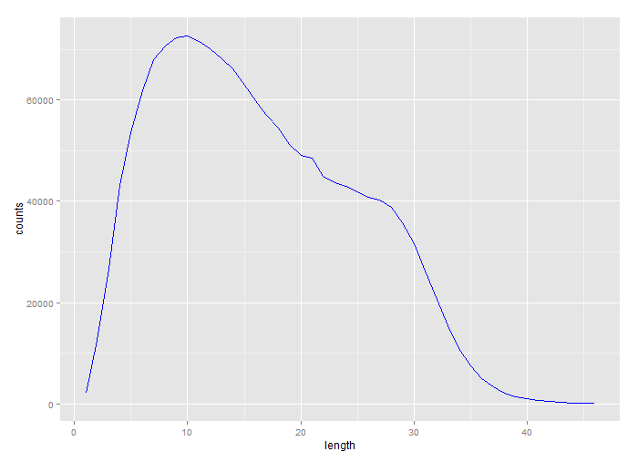

---
# Tweet Sentiment Analysis

Introduction
============

People use Twitter to share their feelings with others. Every day, on
average, around 500 million tweets are tweeted on Twitter. Those
less-than-140 words are short but full of people’s special emotions they
want to express. It is a reflection of people’s real daily life. So it
is of interest to understand people’s emotions when they send a tweet.
In specific, there are four problems that I’m interested into. They are:

-   The variation of sentiments along the time. People’s emotions may be
    different from day to night, from Monday to Sunday.

-   The variation of length of tweets. It is reasonable to guess that
    the when in certain emotion, people tend to speak more/less. So it
    is interesting to find the influences of people’s emotions on their
    willingness to speak (tweet).

-   Understanding the text people would like to put in
    different emotions. What words will people tweet when they are
    happy? What are those they will use when in a low mood? Are there
    any difference and similarity between them?

-   Sentiment prediction of tweets.

Dataset
=======

The datasets I will work on are
[Sentiment140](http://help.sentiment140.com/for-students/), which
collects the 1.6 million tweets from April 6, 2009 to June 25, 2009,
along with users’ sentiments when tweeting.

Exploratory analysis
====================

The variation of sentiments along the time
------------------------------------------

After extracting the sentiment score and the time of the tweet, I
grouped the tweet based on time (same day, same hour), then compute the
average sentiment scores.

The plot above demonstrates the changes of average sentiment scores
(blue) and the total number of tweets (red) in a week. The graph shows
that both the total number of tweets and its average sentiment scores
have similar changing pattern along a week. People’s mood varies a lot
within a day: in weekdays, people are in a low mood in the daytime, but
become happy at night. This finding requires further validation because
it is possible the case that people sending tweets in the daytime and at
night are from different groups. But in general, we can summarize that
the mood of the whole “society” is better at night than in the daytime.

I found a global “U” curve of both curves. This could be view in a more
clear way after smoothing and eliminating the changes within a day,
demonstrated as below.

From the smoothed graph above we can clearly tell that from Sunday, both
the total number of tweets and average sentiment scores are gradually
going down till Thursday evening, then rising back up. The difference is
that the change rate of average sentiment scores is larger, which means
it goes up quickly and goes down quickly. It is also interesting to see
that people actually are in a good mood on Monday, but fast turn into
cloudy mood on Tuesday. Wednesday is the most terrible day and on
Thursday people’s mood are beginning to go up, probably because they
begin to dream the coming weekend. We can also conclude that people tend
to tweet more when they are in a good mood.

The variation of length of tweets
---------------------------------

The length of a tweet is calculated after tokenizing the tweet. Then I
grouped the tweet based on the length, and compute the average sentiment
scores.

Most of tweets are less than 40 words actually. This finding is probably
helpful to the decision of how many words a tweet should be limited.
Interestingly, from the graph we find that it is like a left skewed
distribution but with two peaks. It looks like a combination of two
different distributions, which means that there is probably two
different using patterns: some tweets are normally quite short, about 10
words, while some are commonly about 20 to 30 words.

Then I plot the tweet length against the sentiment scores. The scores is
normalized so that it means “neutral” when it equals zero. In this graph
we can find that tweets in short length probably is labeled as positive,
those in long length shows that people are in a bad mood. The rocket
rise we identify in the graph when the tweet is longer may be because
the small size of biased tweets.

After finding that the variation of sentiments may be hugely influenced
by the number of tweets. I create an overall tweet sentiment index by
multiplying number of tweets with the average sentiment scores. The
graph is demonstrated below.

This way, we can clearly see that tweets in a short length (less than 15
words) have a higher chance to deliver a good mood; a longer tweet (more
than 25 words) is probably about sharing life’s frustrations and want to
get relief from friends.

Understanding the text users use
--------------------------------

A typical way of visualizing the appearance of words in a document is
using word cloud. That way, it is clear to see what words are used most
frequently. So I sample and create the word clouds for the positive
tweets and negative tweets, respectively, shown below.

Cloudwords (positive)     | Cloudwords (negative)
--------------------------|--------------------------
 |

It is interesting to see that both of those tweets use “just” a lot. It
is not surprising that in the postive tweets, “good” is a word with most
apperance. But it’s surprising to see that in the negative tweets,
“like” also appears a lot. This is probably the result of lacking
consideration of negation, that users actually want to say “don’t like…”
Going deeper, we can identify different emotions in both kinds of
tweets. For the positive one, there are “love”, “thanks”, and “new”; in
the negative ones, there are “miss”, “sad”, “need”, (hate of) “work”,
etc.

Language model for sentiment analysis
=====================================

According to the exploratory analysis above, the dataset is divided
based on days: tweets on Friday, Saturday, Sunday and Monday are in one
dataset, the rest the other. [A unigram language
model](https://github.com/yq911122/module/blob/master/lm.py) is
implemented. Different values of the parameter and different smoothing
methods have been tried and cross-validation socre on a 16K sample data
is calculated.

| a     |dirichlet  | jelinek-mercer |
|-------|-----------|----------------|
| 0.05  |  0.9424   |      0.9420    |
| 0.1   |  0.9421   |      0.9402    |
| 0.15  |  0.9415   |      0.9385    |
| 0.2   |  0.9412   |      0.9375    |
| 0.25  |  0.9408   |      0.9350    |
